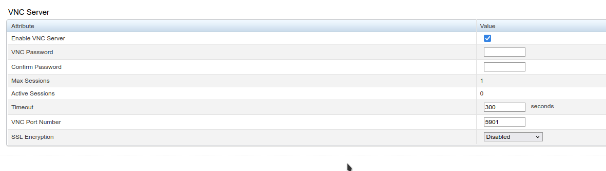

# Dractron

## Abandoned for the most part

I've found that hidden in iDRAC 8 settings is a VNC server, and there is no reason to have a dedicated electron app to run the web console.
<https://www.dell.com/support/manuals/en-us/poweredge-fx2/idrac8_2.30.30.30_ug/configuring-vnc-server-using-idrac-web-interface?guid=guid-20ef1550-da56-43fd-83c5-567309a924cc&lang=en-us>

I haven't gotten SSL encryption working with RealVNC. If I figure it out I will update this readme



---

Electron app for iDRAC

Only tested on iDRAC 8.

Untested on iDRAC 9. I do not have access to an iDrac 9 machine.

At current stage of development, you must have a file named `indevconfig.json` at the head of the project.

```json
{
    "user": "root",
    "pass": "ServerPasswordHere",
    "url": "https://192.168.1.215/"
}
```

Commands:

- `pnpm build`: build the project
- `pnpm run`: run the built project (expects `build` to have been run)
- `pnpm dev`: build and run the project

## What's inside

- Reverse engineered iDrac8 login/logout process (spoiler alert: it's not that hard)
